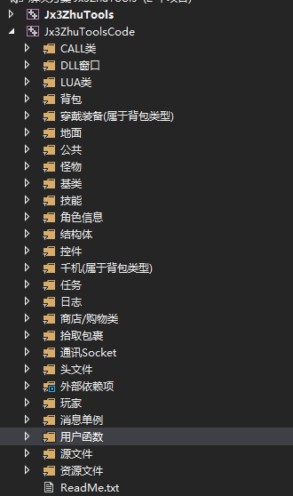

# 剑网三辅助自动任务

#### 介绍
此工程是剑网三（剑侠情缘叁，西山居出品游戏） 全自动跑任务辅助代码

 支持唐门（职业） 从 新手村出生 1 - 75级任务,任务太多，如有需要，请自行编写LUA脚本

编程语言：C/C++

脚本语言：LUA （版本5.3）


LUA 5.3 不支持面向对象编程，此工程在C++ 代码中注册LUA ，使LUA脚本支持面向对象编程

将游戏内的怪物、周围NPC、玩家、任务等数据，通过指针读取出来，放入对象中

HOOK  LUA ，以达到直接使用 游戏内LUA 指令的目的

跟这套源码配套的控制台程序使用C#编写,采用LSP + SOCK5 实现使用代理IP 让每个游戏窗口有单独的IP

后面会将LSP SOCK5 代码一起上传

#### 使用的技术

1. Socket(粘包处理，使用Struct 格式化发包内容,并将收包内容转为Struct )
2. C++ 调用 LUA 、LUA调用C++
3. DLL 注入（将DLL 注入到游戏进程）
4. HOOK( API 、内联 HOOK)
5. 指针读写数据
6. C++使用内联汇编
7. MFC 编程
8. 二叉树和链表
9. LSP SOCK5

### 工程结构



### LUA中使用面向对象

示例：

```lua
function 遍历所有怪物()
	local monsterTree = CCMonsterTree(0);
	local count = monsterTree:LuaSize();
	输出信息("怪物数量:"..count)
	for i=0,count-1 do  
		local __CCMonsterInformation = CCMonsterInformation(monsterTree:LuaGetMonsterInformation(i));
		输出信息("["..(i+1).."] 怪物ID:"..__CCMonsterInformation:getMonsterALLID().." 怪物名称:"..tostring(__CCMonsterInformation:getMonsterName())..","..
		"称号:"..__CCMonsterInformation:getMonsterTitle()..",".." 血量:["..__CCMonsterInformation:getMonsterCurrentBlood().."/"..
		__CCMonsterInformation:getMonsterMaxBlood().."] 坐标:["..__CCMonsterInformation:getMonsterX()..","..__CCMonsterInformation:getMonsterY()..
		"] 距离："..__CCMonsterInformation:getMonsterDsc());
	end
end

遍历所有怪物()
```

### C++注册LUA

将C++中的对象及方法注册到LUA脚本

```c++
	_lua_Status = lua_open();
	//luaL_openlibs(_lua_Status);//打开一些lua 的库文件
	luaopen_string(_lua_Status);

	luaL_openlibs(_lua_Status); 
	luaopen_base(_lua_Status);
```

```c++
//lua 封装类
class RgisterMonsterTree
{
public:
	//注册构造函数  
	static int CreateClass(lua_State* L)  
	{
		int nValue = lua_tointeger(L,1); 
		//这里注册无参数的构造函数就好了，直接赋值，全都赋值了
		*(CCMonsterTree**)lua_newuserdata(L,sizeof(CCMonsterTree*)) = new CCMonsterTree(nValue);
		luaL_getmetatable(L, "CCMonsterTree"); 
		lua_setmetatable(L,-2);
		return 1;  
	}
	//////////////////////////////////////////////////////////////////////////
	//注册函数
	//释放
	static int DestoryClass(lua_State* L)  
	{  
		//释放对象  
		delete *(CCMonsterTree**)lua_topointer(L,1);  
		return 0;  
	}
	//获取怪物数量
	static int CallGetSize(lua_State* L)  
	{ 
		//正确的做法
		CCMonsterTree** pT = (CCMonsterTree**)lua_topointer(L,1);  
		//打印成员变量的值  
		lua_pushnumber(L,(*pT)->LuaSize()); 
		return 1;
	}
	//获取单个对象
	static int CallGetObject(lua_State* L)  
	{ 
		CCMonsterTree** pT = (CCMonsterTree**)lua_topointer(L,1);
		lua_pushnumber(L,(*pT)->LuaGetMonsterInformation((int)lua_tonumber(L,2)));
		return 1;  
	}
	
	static void RegisterInterface(lua_State* L)
	{
		//往lua中注册类  
		//注册用于创建类的全局函数
		lua_pushcfunction(L,&RgisterMonsterTree::CreateClass); 
		lua_setglobal(L,"CCMonsterTree");
		luaL_newmetatable(L,"CCMonsterTree");

		//__gc是lua默认的清理函数  
		lua_pushstring(L,"__gc");  
		lua_pushcfunction(L,&RgisterMonsterTree::DestoryClass);  
		lua_settable(L,-3);//公共函数调用的实现就在此啊  

		lua_pushstring(L,"__index");  
		//注意这一句，其实是将__index设置成元表自己  
		lua_pushvalue(L,-2);  
		lua_settable(L,-3);  

		//放元素中增加函数,这样所有基于该元素的Table就有Add方法了  
		lua_pushstring(L,"LuaSize");  
		lua_pushcfunction(L,CallGetSize);  
		lua_settable(L,-3);

		lua_pushstring(L,"LuaGetMonsterInformation");  
		lua_pushcfunction(L,CallGetObject);  
		lua_settable(L,-3);
		lua_pop(L,1);
	}
};
```


#### LUA注册的函数

```lua
输出信息("输出内容") --输出调试信息
超级延时(1000) -- 延时函数，参数 单位 毫秒
取当前血() --取人物当前血（也可以使用人物对象直接获取）
取血百分比() --取人物血百分比(也可以使用人物对象直接获取)
取等级()--取人物等级(也可以使用人物对象直接获取)
取角色X坐标()--取角色X坐标(也可以使用人物对象直接获取)
取角色Y坐标()--取角色Y坐标(也可以使用人物对象直接获取)
堵塞寻路(X坐标,Y坐标,"N")--寻路到有返回，堵塞寻路，参数1.X坐标，2.Y坐标 3.是否轻功
寻路(X坐标,Y坐标) --普通寻路(等同于寻路CALL) 参数1.X坐标，2.Y坐标
取运行目录() --取dll 当前所在的目录
选怪(怪物ID) --选怪，参数：怪物ID
使用技能(技能ID,技能等级) --使用技能，参数：技能ID,技能等级
名称_打开NPC(对象名称) --打开NPC 对话 参数：要打开对话的NPC
打开NPC(NPCID) -- 打开NC 参数：NPCID
退出组队() -- 退出组队
发起组队(玩家名称) -- 发起组队
接受组队(玩家名称) -- 接受组队
接受最新组队() -- 接受最新的组队请求
计算距离(坐标X,坐标Y) -- 计算传入的坐标跟角色的坐标距离
按键按下F() -- 按下F键
按键抬起F() -- 抬起F键
按键F() -- 上面2个函数的组合(脚本使用这个就OK)
按键按下ESC() --按下ESC键
按键抬起ESC() -- 抬起ESC键
按键ESC() -- 上面2个函数的组合(脚本使用这个就OK)
当前地图(判断地图) -- 判断是否在某地图
--选中怪物使用
--参数1：怪物名称
--参数2: 使用的物品名称
--参数3：延时（1秒就是1 2秒是2...）
选中怪物使用(怪物名称,使用物品名称,延时)
--图内马车 例子
图内马车(图内地图["唐家堡"]["P1"],图内地图["唐家堡"]["P2"],图内地图["唐家堡"]["P3"])
--切换内功
切换内功(内功["惊羽诀"]);
--交互
--参数1.编号
--参数2.常量指针要写入的值
--参数3.行为
交互(22,35,"OnLootBoxItem");
--取技能当前修为(技能.lua)
--参数：技能ID
取技能当前修为(技能ID)
--升级技能(内部调用)
技能升级(所需修为,技能等级,技能ID)
--外部调用
--参数1.技能名称 2.升级到的等级
技能升级_LUA("天女散花",5);
--定点释放技能(内部调用)
--参数1. x坐标，2.y坐标，3.z坐标，4.技能等级，5.技能ID
定点释放技能(X,Y,Z,SkillLevel,SkillID);
--外部调用
--参数：释放的技能名称
定点技能(技能名称)
--获取当前以装备的包裹
取包裹位置()
--装备包裹，（仅限装备包裹）
名称_装备包裹(物品名称)
--奇穴设置
--参数自己设置
奇穴设置(参数1,参数2)
--做机关任务，无参数
机关任务()
--破解机关任务
--NPC 不需要打开和对话，直接跑到跟前调用
--以10次大循环为限,如果觉得不够，可以自己修改大一些
机关任务破解();
--直接传入技能名称，自己判断该如何释放
技能_通用释放(技能名称);

怪物视野值(怪物ID,怪物对象,技能对象)

--取技能对象，（视野判断使用）
取技能对象(技能名称);

--取怪物视野封装一次(脚本中使用)
怪物视野(怪物ID,怪物对象)

--清理周围一定范围怪物，使用前跟任务打怪一样，需要设置技能
清怪(范围)
--取对象类型，传入对象地址
取对象类型(对象地址);

--神行千里传送
--参数1:要传送到的大地图
--参数2:地图的区域
神行千里传送(地图名称,区域名称)
--装备马匹
--参数：马匹的名称
名称_装备马匹(马匹名称);

--调用前先设置保留物品
批量卖物();
--例子
--卖物保留 = {"星落强弩","弹弓","朱浮","百里束腰","绒布系带","百里劲装","野皮裤",
--"百里靴","触目","战魂佩·月","下品止血散","通达券","少侠养成包·30级（萝莉）","霸图",
--"凌霄腰带","虎掷腰","蓝涡","《乾坤一掷·化血镖》参悟残页","隐元秘宝·生皮鞍具"}
--批量卖物()

上马();
下马();

------------------------------------------------------------
[[商店/购物/二级对话 API]]
购买物品(购买物品名称,购买数量)
--商店购买物品(使用前，要先打开NPC对话) 参数：1 购买的物品名称，2.购买数量
任务二级对话(对话索引) --任务二级对话 (使用前，要先打开NPC对话),参数:从0开始，对话的索引
--取千机匣包裹地址
取千机地址()
--取千机匣内物品数量(内部使用)
取千机物品数量(物品名称);
--弩箭数量
弩箭数量();
--机关数量
机关数量();
--取空的千机匣盒子，看是否有可格子
取空千机匣格子();
--装备千机装备(内部用)
装备千机装备(千机数量,千机匣子空格子索引,装备物品的格子索引,装备物品的包裹索引)
--装备千机物品
--参数：物品名称
装备千机物品(物品名称)
--使用礼包专用函数
名称_使用礼包(礼包名称);
刷木童()
登高();
大侠之路();
最终翻牌子();
小关翻牌子();
重新开始第一关();
退出小关();
下一关();
过图(过图的地图ID);
名称_过图(地图名称_过图) -- 根据名称过图
-------------------------------------------------------------
[[任务 API]]
接任务(任务ID,NPCID) --普通的接任务 参数 任务ID，NPCID
交任务(任务ID,NPCID) --普通的交任务 参数 任务ID，NPCID

交任务选物品(任务ID,NPCID,物品选项) -- 0 或 1


NPC名称接任务(NPC名称,任务ID) -- 参数：NPC名称，任务ID
NPC名称交任务(NPC名称,任务ID) -- 参数：NPC名称，任务ID
是否存在任务(判断任务ID) -- 判断某个任务是否已接 参数：要判断的任务ID
是否存在已接任务() -- 判断目前存在已接任务
取任务打怪数量(条件索引,任务ID) --取某个任务 打怪数量 参数：1.要查找的条件的索引（从1开始）2.任务ID
--例子 local 当前已打怪物数,最大数 = 取任务打怪数量(条件索引,任务ID)
取任务步骤完成(步骤索引,任务ID) --取步骤任务的完成情况 完成返回1，未完成返回0

--先对话，在攻击
对话任务(任务类型,任务ID,任务条件索引,范围);
--放弃任务
--参数：任务所以，自己把握(无法控制)
放弃任务(0)

-------------------------------------------------------------
[[采集/拾取 API]]
ID采集(采集ID,物品名称) --根据要采集的对象ID采集(采集后，会自动拾取)，参数1.要采集的对象ID，参数2.采集的物品
ID采集Ex(采集ID,物品名称,采集对象地址) --根据要采集的对象ID采集(采集后，会自动拾取)，参数1.要采集的对象ID，参数2.采集的物品 参数3.采集对象地址
对象采集(采集对象地址,物品名称) --根据要采集的对象地址采集(采集后，会自动拾取)，参数1.要采集的对象地址，参数2.采集的物品
遍历拾取包裹() -- 遍历所有要拾取的物品
拾取包裹(物品ID,拾取对象,物品名称) -- 参数：1.物品ID，2.拾取对象 3.物品名称
拾取全部(拾取对象ID,拾取对象)--拾取所有的物品(包含了拾取金钱) 参数:1.拾取的对象ID，2.拾取对象
拾取金币(拾取对象ID) --参数:拾取的对象ID

--retValue : 1.成功 2.没有找到怪物 3.任务不存在 4.任务打怪异常
--参数1 说明 任务类型：1.打怪数量任务，2.步骤任务
任务打怪(任务类型,任务ID,任务条件索引)
--拾取周围物品
拾取周围()
-------------------------------------------------------------
[[背包API]]
-- 背包.lua 封装
--遍历所有的背包数据
遍历所有背包物品()
--根据物品名称，获取背包内物品数量
取背包内物品数量(物品名称)
--根据物品名称，获取物品所在的包裹索引,格子索引 穿戴位置
取物品格子包裹穿戴(物品名称)
---------------------------------------------------------------
[[装备物品 / 使用物品 / 打开礼包 / 销毁物品]]
-- dll 封装的API
--使用物品
使用物品(包裹索引,格子索引) 
-- 背包.lua 封装
-- 根据物品名称使用物品
名称_使用物品(物品名称)

-- dll 封装的API
--穿戴物品
穿戴物品(穿戴位置,包裹索引,格子索引)
-- 背包.lua 封装
--根据物品名称穿戴物品
名称_穿戴物品(物品名称)
--销毁物品
销毁物品(包裹索引,格子索引)
--根据物品名称使用物品
名称_销毁物品(物品名称)

-----------------------------------------------------------------
[[轻功/跳/打坐/取消打坐/按键]]
人物起跳() --跳CALL
人物轻功(0) --人物轻功(1) 参数 ：0 是关，1是开
打坐()--打坐
取消打坐()--取消打坐
按键(参数)--按键(KEY_LIST["空格"])
----------------------------------------------------------------
[[取转向角度/转向]]
--转向角度参数：针对转向对象的坐标
--返回的是转向的角度
local doubleValue = 取转向角度(8707*1.0,26205*1.0)
转向(doubleValue)--转向操作
----------------------------------------------------------------
```

